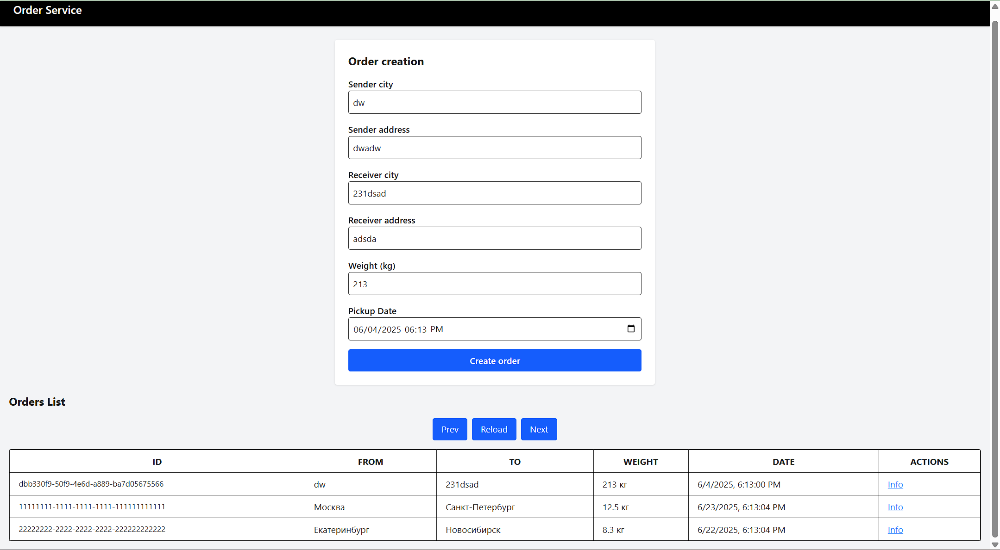

# order-application-versta

### Как запускать:
1) Запускаем docker
2) Запускаем docker-compose
3) Переходим по адресу http://localhost:5173/ - frontend
4) http://localhost:8080/swagger - swagger для api

**P.S.** При запуске api миграции сначала не подключаются к бд по причине не удалось установить соединение. Просто стартаните в докере *order-api* еще раз.

### Кратко про разработку бэка
1) Архитектура - трехслойка (не видел смысла другую делать для простенького api)
2) ORM - EF
3) DB - Postgres
4) Для получения заказов добавил пагинацию + сортировку по новизне

### Небольшой фотоотчет

web-frontend

